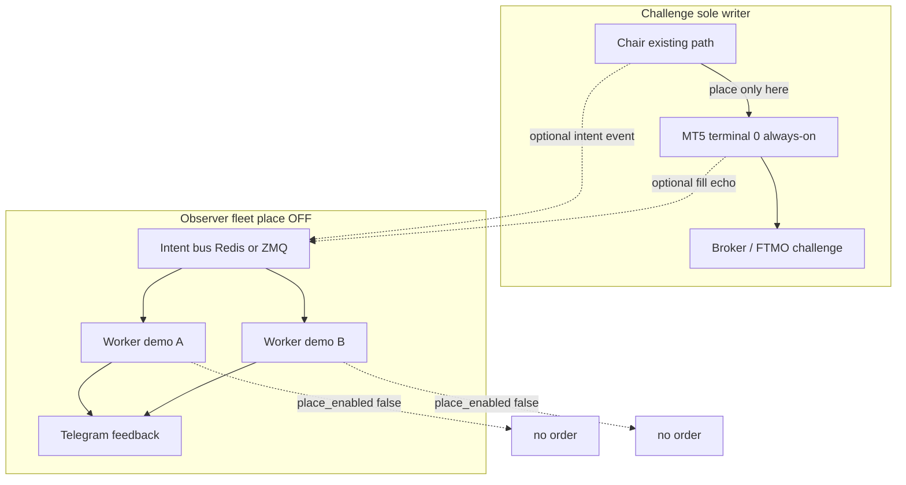

<!-- SUPERSEDED IN PART — 2026-09-19 Owner WORD: Free Trial / demo fan-out PLACE is ON.
     Living docs: ../ARCHITECTURE.md, ../MIRROR_ADAPTER.md, ../RUNBOOK.md
     Still binding from this file: Challenge source 0; quarantine 0;
     VETO challenge↔challenge copy; no NEWS_PROTOCOL; one relay; terminals required for PLACE.
     Attached as provenance from the 2026-09-19 chair pack / P1 one-login design. -->

# MT5 Fan-Out Chair Pack — Open Source Dig
**GTOS / redacted_account | Dig date: 2026-09-19 (Asia/Bangkok UTC+7)**  
**Scope:** Architecture patterns only. No Chair placement code on Challenge path. No NEWS_PROTOCOL. Never place.

**Challenge writer (sole payout path):** login `0`  
**Observers:** Free Trial / demo — watch + Telegram feedback; place **OFF** by default  
**VETO (default):** FTMO challenge↔challenge copy-trade / account-linkage patterns

---

## A. Direct answer (lead)

### Do we need terminals? Can code alone send the same trade intent to many accounts?

**Yes — you need an MT5 terminal process (or broker Manager API). Pure Python cannot talk to the broker.**

| Layer | What it is | Can it place without a terminal? |
|---|---|---|
| `MetaTrader5` Python package | IPC client to a local `terminal64.exe` | **No** — `initialize()` connects to / launches a terminal ([MetaQuotes docs](https://www.mql5.com/en/docs/python_metatrader5/mt5initialize_py)) |
| EA bridge (ZMQ / file / WebSocket) | MQL Expert on a chart ↔ external process | **No** — still requires a running terminal + attached EA |
| Portable / Docker / Wine instances | Isolated terminal processes (often headless) | Still terminals — just not N always-on GUIs on a desk |
| Manager API / mt5manager | Broker-server admin API | **Not retail** — needs broker manager credentials ([MetaQuotes broker APIs](https://www.metatrader5.com/en/brokers); MetaApi Manager docs) |

**Evidence (MetaQuotes):**
- `initialize(path, login=…, password=…, server=…, portable=False)` — “Establish a connection with the MetaTrader 5 terminal… If required, the MetaTrader 5 terminal is launched.”
- `login()` switches account **on an already-connected terminal**; it does not replace the terminal.
- `shutdown()` closes the Python↔terminal connection (terminal process may remain).

**What Python alone cannot do:**
- Open a TCP session to an FTMO/broker trade server as if it were the terminal.
- Fan-out N concurrent accounts from one `import MetaTrader5` process (package is effectively **one connection / one terminal per process**).
- Bypass prop-firm detection of correlated copy across challenge books.

**What code *can* do (architecture, not Challenge placement):**
1. Publish a **trade-intent** event on a bus (Redis/ZMQ/Rabbit) once.
2. Have **N worker processes**, each bound to its own terminal path (`portable=True` or Docker Wine), subscribe and optionally execute — **GTOS: place OFF for observers**.
3. Or: one always-on Challenge terminal (sole writer) + observers that only **read** positions / equity and push Telegram.

**Bottom line for Owner:**  
You do **not** need N always-on desktop GUIs. You **do** need ≥1 terminal process for any book that places. Fan-out of *intent* is a message-bus problem; fan-out of *fills* still requires one terminal (or Manager API) per placing account. For GTOS payout path: **one Challenge terminal for `0` is enough**; fleet fans watch, they do not need writer terminals unless place is explicitly enabled later.

---

## B. SCORE list — Top 5 patterns/repos (GTOS leverage)

Ranked for **architecture steal** (typed adapt), license friendliness, and fit to “intent bus → optional workers” — **not** for dropping Challenge placement code.

### 1. `darwinex/dwxconnect` — score **5/5**
- **URL:** https://github.com/darwinex/dwxconnect  
- **Stars / activity:** ~232★; pushed **2025-05-25**; still watched 2026  
- **License:** **BSD-3-Clause** (prefer)
- **Pattern (3 bullets):**
  - EA (`dwx_server_mt5.mq5`) in terminal Files folder ↔ Python/any-language client via **file IPC** (not raw sockets).
  - One terminal + EA becomes a strategy API: subscribe ticks/bars, open/modify/close orders from external process.
  - Decouples strategy language from MQL; still requires the terminal+EA to be alive.
- **Steal-for-GTOS (typed adapt):** Intent/ack file schema; “external brain, terminal muscle” split; observer mode can read `DWX_Orders.txt`-style state without sending open commands.
- **FTMO/prop caveat:** Bridge on Challenge terminal = automation on that book only. Do **not** wire Challenge EA as publisher into other challenge slaves.
- **Why #1:** Cleanest modern Darwinex successor to ZMQ; permissive license; clear “one terminal per placing book” reality.

### 2. `darwinex/dwx-zeromq-connector` — score **4/5**
- **URL:** https://github.com/darwinex/dwx-zeromq-connector  
- **Stars / activity:** ~372★; last push **2022-05-25** (stale code, still widely referenced)  
- **License:** **BSD-3-Clause**
- **Pattern (3 bullets):**
  - Classic **ZeroMQ PUB/SUB + REQ/REP** bridge EA ↔ Python.
  - Distributed messaging pattern: one master signal → many subscribers (each subscriber still needs its own EA/terminal).
  - Template for an **intent bus** without inventing a new protocol name.
- **Steal-for-GTOS:** Topic layout (tick / order / command); pub/sub fan-out shape; treat as **reference**, prefer dwxconnect for new work.
- **FTMO/prop caveat:** Same as any copy bus — slaves on challenge books = linkage risk. Use for **demo/observer telemetry** only by default.
- **Note:** Stale; use as pattern encyclopedia, not as drop-in dependency.

### 3. `jiowcl/MQL-CopyTrade` — score **4/5**
- **URL:** https://github.com/jiowcl/MQL-CopyTrade  
- **Stars / activity:** ~197★; pushed **2026-01-28**; MIT  
- **License:** **MIT**
- **Pattern (3 bullets):**
  - Explicit **Publisher / Subscriber** EAs over ZMQ (depends on `dingmaotu/mql-zmq`).
  - Features: multi-publisher → subscriber, lot %, symbol map, invert, free-margin check.
  - Publisher can use **investor (read) password** — useful mental model for “watch-only master.”
- **Steal-for-GTOS:** Role split (publish vs subscribe); lot/symbol mapping knobs; **investor-password observer** idea for feedback fleet.
- **FTMO/prop caveat:** Designed for copy-trade. **VETO** as default Challenge↔Challenge. OK as pattern for **demo fan-out if place ever enabled** with place flag default OFF.

### 4. `dingmaotu/mql-zmq` — score **4/5**
- **URL:** https://github.com/dingmaotu/mql-zmq  
- **Stars / activity:** ~696★; Apache-2.0; last push **2023-12-19** (stable lib)  
- **License:** **Apache-2.0**
- **Pattern (3 bullets):**
  - Low-level **ZMQ binding for MQL4/MQL5** — foundation under most OSS copy/bridge EAs.
  - Enables terminal-local EAs to speak PUB/SUB without reinventing sockets in MQL.
  - Not a complete copier; a building block.
- **Steal-for-GTOS:** Keep as optional dependency map if GTOS ever builds a lightweight bridge EA for **non-Challenge** books; Challenge path stays MetaTrader5 Python ↔ single terminal (no new bridge required).
- **FTMO/prop caveat:** Neutral library — risk is in how you wire publishers/subscribers.

### 5. `vdemydiuk/mtapi` (+ infra: `gmag11/MetaTrader5-Docker`) — score **3.5→4/5** (tie-break: mtapi primary)
- **URL:** https://github.com/vdemydiuk/mtapi (~698★, **MIT**, pushed **2026-09-08**)  
- **Companion infra:** https://github.com/gmag11/MetaTrader5-Docker (~393★, **MIT**, Wine/VNC + RPyC via mt5linux)
- **Pattern (3 bullets):**
  - **mtapi:** .NET WebSocket bridge — “not a direct server API”; EA in terminal executes MQL on behalf of external apps. Explicit docs: still needs MT terminal.
  - **Docker:** One container ≈ one isolated MT5 (+ optional Python RPyC) — multi-account = multi-container, not one Python process.
  - Proves “N accounts without N desk GUIs” = **N headless terminal processes**.
- **Steal-for-GTOS:** Headless isolation model for optional demo workers; never put Challenge writer in a shared container with observers.
- **FTMO/prop caveat:** Containerized Challenge is fine for ops; copying Challenge fills into other challenges is still VETO.

**Honorable (not top-5, tracked in JSON):**
- `lucas-campagna/mt5linux` — MIT, ~219★ — Wine + RPyC so Linux Python can drive Windows MetaTrader5 package; multi-instance = multi Wine prefix / port.
- `vobornik/mt4-trade-copy` — **GPL-2.0** flag — classic file-based MT4 copier; pattern only, license friction.
- `TheSnowGuru/PyTrader-…` — ~1049★, license **NOASSERTION** — EA drag-drop socket API; popular but license unclear → treat carefully.
- `ariadng/metatrader-mcp-server` — MIT, ~808★ — **VETO for placement**; LLM-to-place is anti-pattern for Challenge.

---

## C. VETO list (bad ideas for GTOS)

| Idea | Why VETO |
|---|---|
| **Challenge ↔ Challenge / FTMO copy-trade as default** | Prop rules: third-party copy forbidden; own-account copy still risks capital-allocation / identical-strategy linkage detection; Owner already VETO’d. |
| **Always-on N desktop GUIs** | Ops nightmare; RAM; no architectural need if intent bus + optional headless workers. |
| **Place on observer / Free Trial books by default** | Chair policy: observers watch + Telegram; place OFF. |
| **Manager API / mt5manager fantasies** | Broker-side only; GTOS has no manager access to FTMO servers. |
| **“Python alone places on many accounts”** | Contradicts MetaQuotes Python integration model. |
| **Chat-LLM / MCP place bots on Challenge** (`metatrader-mcp-server` class) | Unbounded autonomy + audit failure; not Chair-safe. |
| **GPL drop-ins as core (e.g. `mt4-trade-copy`, `headless-mt5` GPL-3)** | License contagion into GTOS core — pattern-read only. |
| **Shared Wine prefix / shared terminal data folder for multi-login** | MetaQuotes portable mode expects **separate directories** per instance; sharing corrupts state. |
| **Inventing NEWS_PROTOCOL / new named bus for this dig** | Out of scope; use boring Redis/ZMQ topics if needed later. |
| **Any Chair placement recipe on Challenge path from this dig** | Dig is architecture-only; Challenge writer stays existing Chair path. |

---

## D. Recommended GTOS shape

```
┌─────────────────────────────────────────────────────────────┐
│  CHALLENGE PATH (sole writer / payout)                      │
│  Account 0                                          │
│  ┌──────────────────┐    ┌─────────────────────────────┐   │
│  │ Chair (existing) │───▶│ MT5 terminal ALWAYS-ON      │   │
│  │ decision / place │    │ (one process; portable OK)  │──▶│ broker
│  └──────────────────┘    └─────────────────────────────┘   │
│           │ emit INTENT (read-only event) optional           │
│           ▼                                                 │
│     [ intent bus: Redis/ZMQ — NO placement code here ]      │
└─────────────────────────────────────────────────────────────┘
                              │
                              ▼  subscribe (telemetry)
┌─────────────────────────────────────────────────────────────┐
│  OBSERVER FLEET (Free Trial / demo)                         │
│  place_enabled = false  (DEFAULT)                           │
│  ┌────────────┐   ┌──────────────────────────────────────┐ │
│  │ Worker(s)  │──▶│ optional: login→read equity/pos→     │ │
│  │            │   │ logout OR light bridge; Telegram out │ │
│  └────────────┘   └──────────────────────────────────────┘ │
│  IF place ever enabled (explicit Owner gate):               │
│    intent → worker initialize(path_i) → send → shutdown     │
│    OR dedicated lightweight bridge per demo terminal        │
│    NEVER auto-wire from Challenge writer module             │
└─────────────────────────────────────────────────────────────┘
```

**Rules baked in:**
1. **Challenge-only terminal always-on** = sole writer for `0`.
2. **Fan-out workers** are for demos/observers: watch + Telegram; **place OFF**.
3. If fan-out place is ever enabled: **intent bus → worker login→send→logout** *or* dedicated bridge — **separate codebase / flag from Challenge Chair path**; this dig ships **no** Challenge placement code.
4. Do not use Manager API.
5. Do not default-enable FTMO challenge copy.

---

## E. Short synthesis (mermaid)



**ASCII (minimum viable):**

```
Chair ──place──▶ [MT5 term #0] ──▶ broker   ★ only writer
   │
   └──intent──▶ BUS ──▶ workers(demo*) ──▶ Telegram
                         └── place_flag=OFF (default)
```

---

## Owner Q&A (one paragraph)

**Q:** Do we need terminals? Can code send the same trade intent to many accounts?  
**A:** Intent — yes, via a bus. Fills — only through a terminal (or broker Manager API we do not have). MetaQuotes Python is a terminal client, not a broker client. GTOS therefore keeps **one always-on Challenge terminal** as the sole writer and treats multi-account fan-out as **optional observer workers** (telemetry first). That is the OSS consensus across dwxconnect, ZMQ copiers, mtapi, and Docker/Wine multi-instance projects.

---

## Dig provenance
- MetaQuotes: https://www.mql5.com/en/docs/python_metatrader5/mt5initialize_py  
- FTMO Futures Forbidden Practices (copy / third-party / personal-use): https://ftmo.com/en/futures/forbidden-trading-practices  
- Repos verified via GitHub API `2026-09-19` (see `MT5_FANOUT_repos.json`)
